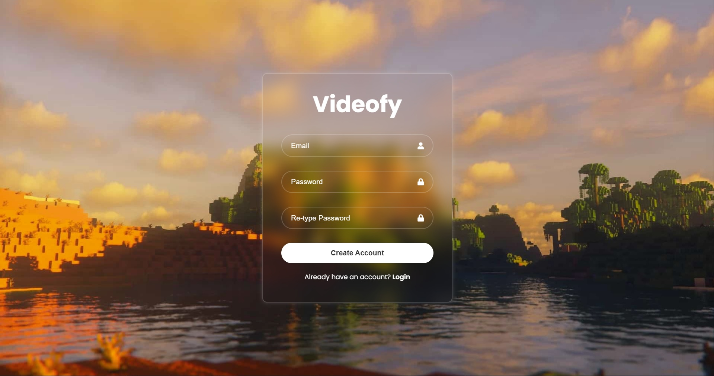
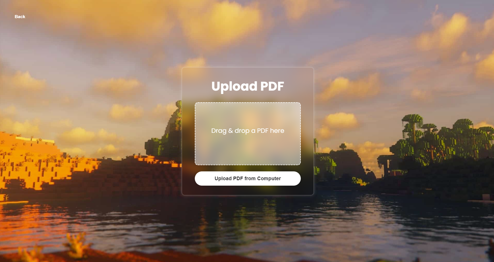

<a id="readme-top"></a>


<!-- PROJECT LOGO -->
<br />
<div align="center">
  <h3 align="center">Videofy</h3>

  <p align="center">
    Transform your boring lecture notes into an engaging study video featuring Minecraft Parkour with the click of a button!
    <br />
    <br />
    <br />
  </p>
</div>


<!-- TABLE OF CONTENTS -->
<details>
  <summary>Table of Contents</summary>
  <ol>
    <li>
      <a href="#about-the-project">About The Project</a>
      <ul>
        <li><a href="#built-with">Built With</a></li>
      </ul>
    </li>
    <li>
      <a href="#getting-started">Getting Started</a>
      <ul>
        <li><a href="#prerequisites">Prerequisites</a></li>
        <li><a href="#installation">Installation</a></li>
      </ul>
    </li>
    <li><a href="#usage">Usage</a></li>
  </ol>
</details>


<!-- ABOUT THE PROJECT -->
## About The Project


Have you ever been studying your textbook for a course and its so mind-numbingly dull you just want to quit altogether? Well, look no further because Videofy has you covered. I created a simple and intuitive application that allows you to upload any PDF file and convert the contents into a "brain-rot" style video like the ones you might find on TikTok or Instagram Reels. So for those of you who can't focus for more than 5 minutes without scrolling on your phone, this is for you!


### Built With

This project was built with the popular FERN Stack along with Python for PDF content extraction and OpenAI API integration.

 
 
 
 
 

 
 
<p align="right">(<a href="#readme-top">back to top</a>)</p>


<!-- GETTING STARTED -->
## Getting Started

This is an example of how you may give instructions on setting up your project locally.
To get a local copy up and running follow these simple example steps.

## Prerequisites:
Node.js (v14 or higher)__
Python (v3.8 or higher)__
FFmpeg (for video processing)

### Installation

1. Clone the repo
   ```sh
   git clone https://github.com/brian-fu/Videofy.git
   ```
2. Install dependencies
   ```sh
   cd frontend
   npm install

   cd ../backend
   npm install express cors multer dotenv uuid
  
   python -m venv python_env
   python_env\Scripts\activate
   install openai python-dotenv pydub

   mkdir -p backend/input backend/output
   ```
3. Running the Program:
  ```sh
   cd backend
   node index.js

   cd ../frontend
   npm run dev
  ```
  

<p align="right">(<a href="#readme-top">back to top</a>)</p>


<!-- USAGE EXAMPLES -->
## Usage

1. Create an account or log in
2. Upload a PDF document
3. Wait for processing (the PDF will be converted to speech and combined with video)
4. Preview and download your generated video

## Screenshots

### Create Account Preview


### Login Screen Preview


### Upload PDF File Preview



<p align="right">(<a href="#readme-top">back to top</a>)</p>


